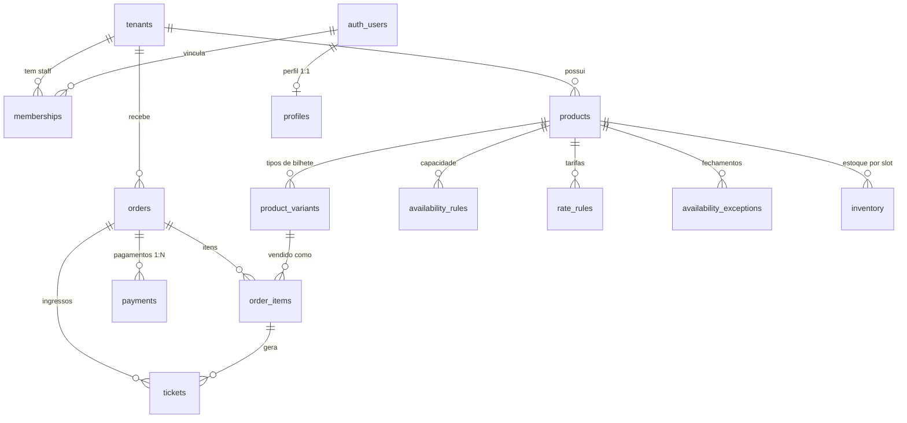

# Schema do banco — Blockticket (MVP)

Motor de reservas + checkout + gestão multi-tenant para parques e atrações.
Postgres/Supabase com RLS em todas as tabelas.

## Diagrama (ERD)

## Tabelas por domínio

| Domínio | Tabelas |
|---|---|
| Tenancy & acesso | `tenants`, `profiles`, `memberships` |
| Catálogo | `products`, `product_variants` |
| Disponibilidade & tarifa | `availability_rules`, `rate_rules`, `availability_exceptions`, `inventory` |
| Vendas | `orders`, `order_items`, `payments`, `tickets` |

## Decisões-chave

- **Multi-tenant por `tenant_id` + RLS** em toda tabela. Escala para vários
  clientes da FozDev sem separar banco; single-tenant (Aquamania) é só um
  registro em `tenants`.
- **Papéis via `memberships`** (owner/admin/staff). Cliente final não é membro —
  é um usuário autenticado (ou guest) que só cria pedidos.
- **Dinheiro em centavos (`integer`)** — sem ponto flutuante.
- **Regras × Estoque separados.** `availability_rules`/`rate_rules` descrevem o
  recorrente (dia da semana, temporada, horário); `inventory` materializa o
  contador real por slot e é a fonte da verdade para concorrência (trava
  `FOR UPDATE` na reserva). Exceções pontuais em `availability_exceptions`.
- **Pagamento parcial/integral** modelado por `orders.paid_cents` vs
  `orders.total_cents` com N linhas em `payments`. O PSP (Pagar.me/AbacatePay)
  é a autoridade do status; nunca construímos gateway próprio.
- **Escrita sensível fora do cliente.** Catálogo é escrito por staff (RLS);
  reserva de estoque, pagamentos e emissão de ticket passam por RPC
  `SECURITY DEFINER` / webhook `service_role` — clientes só leem.

## Funções (RPCs)

Leitura (0007) — expostas a anon/authenticated:
- `resolve_price_cents(product, variant, date, session)` → preço efetivo.
- `get_slot_capacity(product, date, session)` → capacidade do slot.
- `get_remaining(product, date, session)` → vagas restantes.
- `get_order_public(order_id)` → pedido + itens + tickets (id = capability).

Escrita segura:
- `create_order_with_hold(tenant, items, customer, hold_minutes)` (0010) —
  cria pedido + segura estoque com trava `FOR UPDATE`. Preço sempre no servidor.
- `mark_order_paid(order_id)` (0010) — `service_role`: `reserved → sold` + emite
  tickets. Substitui pelo webhook real do PSP.
- `expire_holds()` (0010) — `service_role`: libera holds expirados (agendar cron).

Auth (0009):
- `handle_new_user()` — trigger em `auth.users`: cria profile e concede owner
  de bootstrap conforme `tenants.settings.bootstrap_admin_email`.

## Ainda não implementado (próximos passos)

- Webhook real do PSP (Pagar.me/AbacatePay) substituindo `mark_order_paid`.
- Agendar `expire_holds()` (cron/edge function).
- Split de comissão, afiliados, integração com catraca — pós-MVP.
- CRUD de produtos/tarifas no painel admin (hoje o dashboard é leitura).
